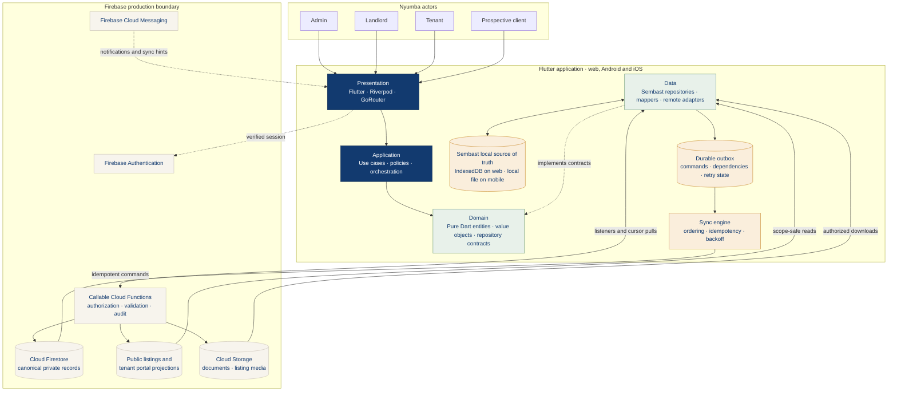

# Nyumba Property Management

Nyumba is an offline-first Flutter application for rental property management. One responsive codebase supports web, Android, and iOS, with role-aware experiences for landlords, tenants, platform administrators, and prospective tenants.

The current build is a functional implementation baseline backed by Sembast and seeded demo data. Firebase packages, security rules, indexes, and backend contracts are included, but no Firebase project credentials or generated options are committed yet.

## Implemented experiences

- **Client:** browse available units without signing in, view listing details, contact a landlord, and submit a rental application.
- **Landlord:** use the operational dashboard; manage properties and units; review tenants, finances, payments, maintenance, listings, and applications; advertise an available unit; and generate printable documents.
- **Tenant:** view rent and lease information, access payment actions, submit and track maintenance requests, and open shared documents.
- **Admin:** review platform activity, users and landlord status, subscription plans, and system reports.

The application starts at the public listing catalogue (`/explore`). Authentication and role guards then route signed-in users to their permitted workspace.

## Architecture

Nyumba follows feature-first clean architecture with an offline-first data path. The diagram shows both the implemented Flutter/local layers and the Firebase production boundary that the included contracts and rules are designed to connect to.



### How the architecture works

1. **Actors enter through one role-aware presentation layer.** GoRouter guards and the responsive app shell select the correct landlord, tenant, admin, or public experience. These guards improve navigation; Firebase Rules and Cloud Functions remain the real authorization boundary.
2. **Business rules point inward.** Presentation invokes application behavior, application code depends on domain contracts, and the pure Dart domain does not import Flutter, Firebase, Sembast, or persistence DTOs. Data implementations satisfy those contracts and are composed during bootstrap.
3. **Every screen reads local state first.** Repositories stream Sembast records to the UI, so cached properties, units, listings, and pending work remain usable without a network connection. Firestore never feeds widgets directly.
4. **Offline writes are atomic and durable.** A repository stores the optimistic entity change and its outbox command in one local transaction. The sync engine later preserves aggregate dependencies, reuses the same idempotency key, and retries transient failures with backoff.
5. **Sensitive outcomes stay server-authoritative.** Payments, receipts, lease activation, landlord approval, subscriptions, unit entitlements, and listing publication are confirmed only by trusted backend logic. Cloud Functions update canonical records and create deliberately limited public or tenant projections.
6. **Remote changes return through the same local database.** Firestore listeners or cursor-based pulls merge authorized server state into Sembast; the UI then reacts to the local stream. This keeps online and offline rendering on one predictable path.

The local database, repositories, outbox, sync engine, and demo gateway are implemented. The Firebase side of the diagram is currently represented by packages, security rules, indexes, and backend contracts; it requires environment credentials and production command handlers before release.

- `lib/app/` contains bootstrap, routing, navigation, and brand theme composition.
- `lib/core/domain/` contains shared domain primitives and validation.
- `lib/core/offline/` contains the local database, durable outbox, sync metadata, network hints, and sync engine.
- `lib/features/` keeps each business capability's domain, data, application, and presentation concerns together.
- `docs/architecture/` defines the wider production architecture, data/security model, offline contract, and callable command envelopes.
- `firebase/` contains environment-neutral Firestore/Storage rules, indexes, emulator configuration, and the Cloud Functions implementation handoff.

Widgets read repository streams; they do not query Firestore or open Sembast directly. Domain models remain independent of Flutter, Firebase, and persistence DTOs.

Contributors and coding agents should read [AGENTS.md](AGENTS.md) before changing architecture or persistence behavior.

## Offline-first behavior

Sembast is the application source of truth (IndexedDB on web and a local database file on mobile). Repository reads therefore render cached data immediately.

For an offline-capable mutation, the local entity change and its outbox command are committed in one transaction. Commands use stable client-generated IDs, preserve dependency order, and are retried idempotently with backoff through `RemoteSyncGateway`. Records expose pending, synced, conflicted, and rejected states so the UI does not equate local acceptance with server confirmation.

Low-risk property and draft edits can appear optimistically. Payments, receipts, subscription state, landlord approval, unit entitlements, lease activation, and listing publication remain server-authoritative. A listing becomes publicly visible only after its publication command is acknowledged and its local state is synced.

See [the offline synchronization contract](docs/architecture/offline-sync.md) for conflict, retry, pull, attachment, and account-switch policies.

## Quick start

Prerequisites: Flutter `3.44.2` or a compatible stable release and Dart `3.12.2` or later.

```sh
flutter pub get
flutter run -d chrome
```

For a connected Android device, emulator, or iOS simulator:

```sh
flutter devices
flutter run -d <device-id>
```

From **Sign in**, choose **Landlord**, **Tenant**, or **Admin** under "Explore the role demos." The regular prefilled sign-in form also opens the landlord demo. Prospective-tenant flows are available directly from **Browse available homes** and do not require a demo role.

Demo identities and data are local only; they are not Firebase accounts and must not be used as production fixtures.

## Firebase handoff

No Firebase project ID, API key, service account, `.firebaserc`, or generated `firebase_options.dart` is included. To connect an environment:

1. Create separate development, staging, and production Firebase projects, then run `flutterfire configure` for each intended Flutter platform.
2. Initialize `Firebase.initializeApp` with the generated options during bootstrap and replace the local demo session with a Firebase Auth adapter.
3. Implement `RemoteSyncGateway` against authenticated callable Cloud Functions using [the backend command contracts](docs/architecture/backend-command-contracts.md). The current demo gateway is deliberately local and idempotent.
4. Implement the server-authoritative command handlers described in [firebase/functions/COMMANDS.md](firebase/functions/COMMANDS.md), including entitlement, approval, publication, invoice, payment, projection, and audit checks.
5. Validate the provided rules and queries with the Emulator Suite before deploying them to an explicitly selected non-production project:

   ```sh
   cd firebase
   firebase emulators:start --config firebase.json --project <nyumba-dev-project-id>
   ```

6. Register and enforce App Check, configure FCM and Storage, add rules/command integration tests, and deploy with an explicit `--project` value.

Review [the Firebase handoff](firebase/README.md) and [data and security model](docs/architecture/firebase-data-and-security.md) before implementing remote writes. The supplied rules intentionally deny direct client writes to canonical records.

## Verification

Run the static checks and automated tests from the repository root:

```sh
flutter analyze
flutter test
flutter build web --release
flutter build apk --debug
```

On macOS with Xcode configured, also verify the iOS target:

```sh
flutter build ios --no-codesign
```

The test suite covers the offline database transaction, outbox sync behavior, domain validation, public-listing visibility, and application bootstrap/widget rendering.

## Supported platforms

| Platform | Project target | Local persistence |
| --- | --- | --- |
| Web | `web/` | Sembast over IndexedDB |
| Android | `android/` | Sembast local file |
| iOS | `ios/` | Sembast local file |

## Product configuration still TBD

Nyumba's plan names are **Starter**, **Pro**, **Premium**, and **Enterprise**, but subscription prices, billing intervals, trials, grace periods, feature entitlements, and per-plan unit limits are not finalized. These values must be supplied by server-owned configuration and must not be hard-coded in Flutter or security rules. Until they are approved, production entitlement checks should fail closed.

Other production decisions still required include Firebase project IDs and region, production Android/iOS bundle identifiers and signing, payment provider and currencies, public-listing lifetime/moderation, upload limits, and retention policies. The full list is maintained in [the architecture overview](docs/architecture/README.md).
