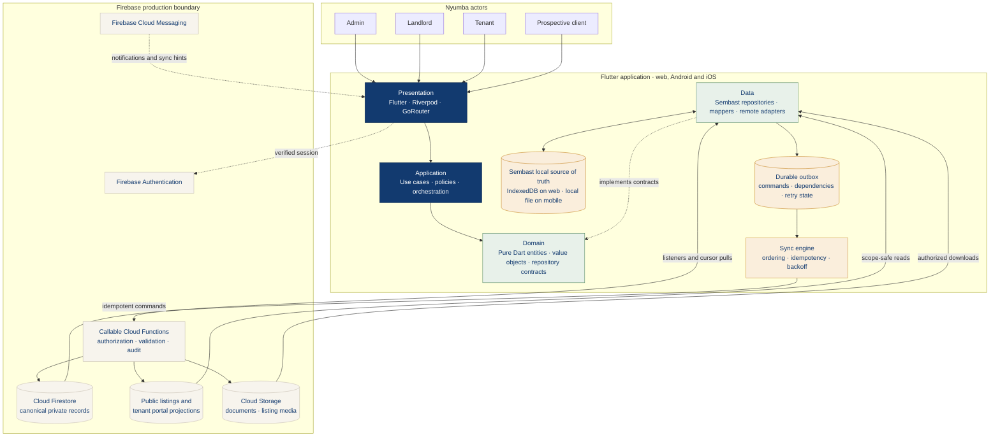

# Nyumba Property Management

Nyumba is an offline-first Flutter application for rental property management. One responsive codebase supports web, Android, and iOS, with role-aware experiences for landlords, tenants, platform administrators, and prospective tenants.

The app runs against a real development Firebase backend (`nyumba-property-management`, Blaze plan): callable command handlers, security rules, indexes, background workers, and transactional email are implemented and deployed by CI from `main`, while Sembast keeps every screen usable offline. Generated configuration (`lib/firebase_options.dart`, `google-services.json`, `GoogleService-Info.plist`) is **gitignored by design** — every contributor regenerates it with `flutterfire configure`; no credentials, service accounts, or `.env` files are ever committed.

## Implemented experiences

- **Client:** browse available units without signing in, view listing details, contact a landlord, and submit a rental application.
- **Landlord:** use the operational dashboard; manage properties and units; review tenants, finances, payments, maintenance, listings, and applications; advertise an available unit; and generate printable documents.
- **Tenant:** view rent and lease information, access payment actions, submit and track maintenance requests, and open shared documents.
- **Admin:** review platform activity, the live account directory (users, landlord status, subscriptions, audit logs), and system reports; approve, suspend, or reinstate landlords through audited server commands.

The application starts at the public listing catalogue (`/explore`). Authentication and role guards then route signed-in users to their permitted workspace. On Android and iOS, an optional biometric app lock gates re-entry to an existing session; it stores no credentials and never replaces authentication.

Not yet real, and not presented as real: no mobile-money provider is integrated (`payment.initiate` fails closed with `providerNotConfigured`), and App Check enforcement is off (web attestation is active; iOS App Attest is deferred until a paid Apple Developer team exists).

## Architecture

Nyumba follows feature-first clean architecture with an offline-first data path. The diagram shows the Flutter/local layers and the server-authoritative Firebase boundary they synchronize with.



### How the architecture works

1. **Actors enter through one role-aware presentation layer.** GoRouter guards and the responsive app shell select the correct landlord, tenant, admin, or public experience. These guards improve navigation; Firebase Rules and Cloud Functions remain the real authorization boundary.
2. **Business rules point inward.** Presentation invokes application behavior, application code depends on domain contracts, and the pure Dart domain does not import Flutter, Firebase, Sembast, or persistence DTOs. Data implementations satisfy those contracts and are composed during bootstrap.
3. **Every screen reads local state first.** Repositories stream Sembast records to the UI, so cached properties, units, listings, and pending work remain usable without a network connection. Firestore never feeds widgets directly.
4. **Offline writes are atomic and durable.** A repository stores the optimistic entity change and its outbox command in one local transaction. The sync engine later preserves aggregate dependencies, reuses the same idempotency key, and retries transient failures with backoff.
5. **Sensitive outcomes stay server-authoritative.** Payments, receipts, lease activation, landlord approval, subscriptions, unit entitlements, and listing publication are confirmed only by trusted backend logic. Cloud Functions update canonical records and create deliberately limited public or tenant projections.
6. **Remote changes return through the same local database.** Firestore listeners or cursor-based pulls merge authorized server state into Sembast; the UI then reacts to the local stream. This keeps online and offline rendering on one predictable path.

Both sides of the diagram are implemented: the local database, repositories, outbox, sync engine, and in-memory fallback gateway in Flutter, and the callable command router, Firestore/Storage rules, indexes, auth provisioning trigger, and background workers on Firebase — deployed to the development project by CI from `main`. Anonymous/unauthenticated browsing is cloud-backed for public listings; anonymous workspaces otherwise use the in-memory fallback gateway.

- `lib/app/` contains bootstrap, routing, navigation, and brand theme composition.
- `lib/core/domain/` contains shared domain primitives and validation.
- `lib/core/offline/` contains the local database, durable outbox, sync metadata, network hints, and sync engine.
- `lib/features/` keeps each business capability's domain, data, application, and presentation concerns together.
- `docs/architecture/` defines the wider production architecture, data/security model, offline contract, and callable command envelopes.
- `firebase/` contains environment-neutral Firestore/Storage rules, indexes, emulator configuration, and the Cloud Functions implementation handoff.

Widgets read repository streams; they do not query Firestore or open Sembast directly. Domain models remain independent of Flutter, Firebase, and persistence DTOs.

Contributors and coding agents should read [AGENTS.md](AGENTS.md) before changing architecture or persistence behavior.

## Offline-first behavior

Sembast is the application source of truth (IndexedDB on web and a local database file on mobile). Repository reads therefore render cached data immediately.

For an offline-capable mutation, the local entity change and its outbox command are committed in one transaction. Commands use stable client-generated IDs, preserve dependency order, and are retried idempotently with backoff through `RemoteSyncGateway`. Records expose pending, synced, conflicted, and rejected states so the UI does not equate local acceptance with server confirmation.

Low-risk property and draft edits can appear optimistically. Payments, receipts, subscription state, landlord approval, unit entitlements, lease activation, and listing publication remain server-authoritative. A listing becomes publicly visible only after its publication command is acknowledged and its local state is synced.

See [the offline synchronization contract](docs/architecture/offline-sync.md) for conflict, retry, pull, attachment, and account-switch policies.

## Localization

Nyumba ships in English (`en`), Luganda (`lg`), Kiswahili (`sw`), and Arabic (`ar`), with full right-to-left support for Arabic. The language menu is available before sign-in; an authenticated selection is saved with the user profile and synced offline-first like any other edit. All four `assets/l10n/app_*.arb` catalogs must stay in message-key parity — localization is part of every feature's definition of done. See [the localization contract](docs/architecture/localization.md).

## Quick start

Prerequisites: Flutter `3.44.2` or a compatible stable release and Dart `3.12.2` or later.

```sh
flutter pub get
flutter run -d chrome
```

For a connected Android device, emulator, or iOS simulator:

```sh
flutter devices
flutter run -d <device-id>
```

From **Sign in**, sign in with email/password or Google, or create a landlord account via **Sign up**. Anyone can browse the public marketplace without signing in via **Browse available homes**.

## Authentication and roles

Firebase Authentication (email/password and Google) backs real sessions; role-based authorization is enforced server-side and mirrored in client routing:

- **Landlord** — self-registration. Sign up (or continue with Google), verify your email, then complete onboarding: the `landlord.onboard` command creates the landlord account in `pending` approval with a starter-trial subscription. A platform admin approves it (`firebase/functions/scripts/approve-landlord.mjs` until the admin UI is wired), which unlocks entitled actions.
- **Tenant** — never self-registers. A landlord adds the tenant's email (`tenant.invite`); when a user signs in with that verified email, `tenant.claimInvite` links the record, promotes the role, and provisions their portal projections automatically.
- **Admin** — the `platformAdmin` custom claim, granted with `firebase/functions/scripts/grant-admin.mjs <email> --project <project-id>` after the account's first sign-in. Admins have broad operational access but cannot manage privileged accounts.
- **Super Admin** — the separate `superAdmin` custom claim, granted only through a controlled operator environment with `firebase/functions/scripts/grant-admin.mjs <email> --super-admin --project <project-id>`. Super Admins manage privileged accounts and protected platform configuration.
- **Prospective tenant** — browses `/explore` without an account; contact/application submissions use anonymous auth.

Email verification is required before a session loads (Google accounts arrive verified). Ordinary roles come from the server-owned `users/{uid}` document; Admin and Super Admin come only from verified custom claims. GoRouter guards are UX only; Firestore Rules and callable command checks remain the authorization boundary. See [`docs/architecture/role-permissions.md`](docs/architecture/role-permissions.md) for the complete matrix.

## Firebase configuration

The development environment is connected to the `nyumba-property-management` project (Blaze plan, region `europe-west1`). Client configuration is generated per machine and per environment — it is intentionally not in version control:

```sh
dart pub global run flutterfire_cli:flutterfire configure --project nyumba-property-management
```

This writes `lib/firebase_options.dart` and the platform files (`android/app/google-services.json`, `ios/Runner/GoogleService-Info.plist`), all covered by `.gitignore`. These are client identifiers, not secrets — real protection comes from Security Rules, App Check, and API-key restrictions in the Google Cloud console — but keeping them out of the repository keeps environments explicit and prevents accidental cross-environment builds. Service accounts, `.env` files, and signing keys are likewise ignored and must never be committed.

The canonical production web origin is <https://nyumba.online>, served by the
`nyumba-property-management` Firebase Hosting site. This settles the public
domain; it does not replace the still-pending work to create separate staging
and production Firebase projects.

Deployed to the development project: callable command handlers
(`executeCommand`), the read-only public SEO renderer (`publicSeo`), the auth
provisioning trigger, background workers, Firestore/Storage rules and indexes,
and the Storage default bucket (all `europe-west1`). Public marketplace URLs
receive server-rendered canonical metadata, crawlable listing content, and
structured data before Flutter starts; private application routes are
`noindex`. Operational configuration is seeded with
`firebase/functions/scripts/seed-entitlements.mjs`.

Transactional email is sent through Resend from the `nyumba.online` domain: all email leaves via durable backend jobs (never directly from request handlers), including a daily rent-reminder sweep. The `RESEND_API_KEY` secret lives in the Functions environment, never in the repository.

Remaining backend work before release:

1. Create the staging and production Firebase projects (same region, `europe-west1`) and run `flutterfire configure` against each.
2. Finish App Check: web reCAPTCHA v3 attestation is active but enforcement is off — follow the sequence in [the architecture overview](docs/architecture/README.md) before flipping `ENFORCE_APP_CHECK` in `firebase/functions/src/shared/config.ts` and enabling console enforcement. Android Play Integrity still needs registration; iOS App Attest is deferred until a paid Apple Developer team exists.
3. Integrate the payment provider and replace the starter-trial subscription placeholder with webhook-owned billing state. Until then, `payment.initiate` fails closed with `providerNotConfigured`.
4. Configure FCM, and validate rules and commands with the Emulator Suite before each deploy:

   ```sh
   cd firebase/functions
   npm run test:emulator
   ```

Review [the Firebase handoff](firebase/README.md) and [data and security model](docs/architecture/firebase-data-and-security.md) before changing remote write or sync behavior. The rules intentionally deny direct client writes to canonical records — all canonical mutations cross the callable command envelope.

## Verification

Run the static checks and automated tests from the repository root:

```sh
flutter analyze
flutter test
flutter build web --release
flutter build apk --debug
```

On macOS with Xcode configured, also verify the iOS target:

```sh
flutter build ios --no-codesign
```

The test suite covers the offline database transaction, outbox sync behavior, domain validation, public-listing visibility, and application bootstrap/widget rendering.

For backend changes, run from `firebase/functions/`:

```sh
npm run typecheck
npm test                # unit tests, including the job-registry coverage check
npm run test:emulator   # rules + command integration against the emulator
```

## CI/CD

The pipeline in `.github/workflows/ci-cd.yml` analyzes and tests every pull request. On push to `main` it additionally deploys the web app to Firebase Hosting (live channel) and produces an APK and unsigned IPA as workflow artifacts; pushing a `v*` tag attaches both builds to a GitHub Release. The gitignored Firebase configuration is recreated in CI from repository secrets — see [docs/CI_CD.md](docs/CI_CD.md) for the required secrets and setup commands.

## Supported platforms

| Platform | Project target | Local persistence |
| --- | --- | --- |
| Web | `web/` | Sembast over IndexedDB |
| Android | `android/` | Sembast local file |
| iOS | `ios/` | Sembast local file |

## Product configuration

Finalized decisions (mirrored in [`lib/core/config/market_config.dart`](lib/core/config/market_config.dart); the backend stays authoritative):

- **Market:** Uganda only at launch — UGX currency, `+256` E.164 phone numbers, `Africa/Kampala` reporting timezone. Payment rails: MTN Mobile Money, Airtel Money, bank transfer, landlord-recorded cash. Uganda VAT (18%) on subscription fees is computed server-side.
- **Firebase region:** `europe-west1` (Firestore, Cloud Functions, Storage).
- **Production web origin:** <https://nyumba.online> on Firebase Hosting.
- **Listing lifetime:** published listings expire 30 days after (re)publication and are renewable by the landlord; expiry is enforced server-side.
- **Upload limits:** max 10 photos per listing at 5 MB each (jpeg/png/webp); documents up to 10 MB (pdf/jpeg/png) — enforced in `firebase/storage.rules`.
- **Retention:** financial records 7 years; deleted listings/media purged after 90 days; maintenance media 2 years.

Still TBD: Nyumba's plan names are **Starter**, **Pro**, **Premium**, and **Enterprise**, but subscription prices, billing intervals, trials, grace periods, feature entitlements, and per-plan unit limits are not finalized. These values must be supplied by server-owned configuration and must not be hard-coded in Flutter or security rules. Until they are approved, production entitlement checks should fail closed.

Other production decisions still required include staging/production Firebase project IDs, production Android/iOS bundle identifiers and signing, the mobile-money aggregator, and the listing moderation policy. The full list is maintained in [the architecture overview](docs/architecture/README.md).
